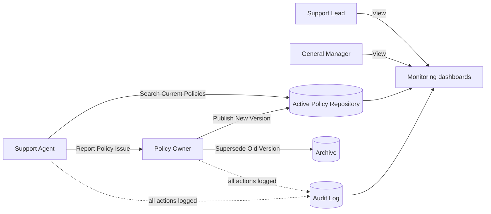

```markdown
# Jirani Home Controlled Policy Library

A Streamlit prototype for a Business Systems Analysis (BSA) assessment.

---

## 1. Project Title

**Jirani Home Controlled Policy Library** — a Streamlit prototype for a Business Systems Analysis (BSA) assessment.

---

## 2. Overview

This is a functional prototype for assessment and requirements validation. It demonstrates a future-state controlled policy library for Jirani Home, an online retailer of small home appliances. It gives customer-support staff one searchable source of current approved policies and keeps superseded policies in a separate archive.

It is not a production system. It uses sample data only, runs entirely on local CSV files, and has no AI, no external APIs, no live order/refund/courier integration, and no automatic customer response function.

---

## 3. Make integration and workflow delivery

The app now includes a Make Custom Webhook integration for policy issue reporting. When a Support Agent submits a policy issue, the local CSV record is created first, the issue is sent to the Make webhook, and the workflow status is updated in-place.

The Make integration is intentionally limited to a policy-owner review task workflow and does not perform AI processing, automatic approvals, automatic customer responses, or any financial, warehouse, courier, or CRM decision-making.

### Local configuration

1. Copy `.env.example` to `.env`.
2. Set the webhook URL in `.env` using the environment variable:
   ```bash
   MAKE_POLICY_ISSUE_WEBHOOK_URL=https://hook.make.com/replace-with-your-webhook-id
   ```
3. Start the app with:
   ```bash
   streamlit run app.py
   ```

If the environment variable is missing, the app still saves the issue locally and shows a local-prototype message instead of crashing.

## 4. Business Problem

The support team currently works from a shared inbox, order exports, a courier portal, and a folder that mixes current and outdated policy documents.

A quality review found that six initial customer-response drafts used an outdated policy. Four were corrected before sending, but two reached customers.

Policy lookup took an average of 6 minutes out of 16 minutes of active work in an observed sample of return/damage tickets.

Outdated policies therefore caused incorrect customer-response drafts and wasted agent effort.

---

## 4. Selected Opportunity

Create a controlled policy library where:

- Support agents find one reliable, current, approved policy quickly.
- Policy owners control ownership, approval, versioning and review dates.
- The support lead sees policy-related quality issues.
- Management can measure the reduction in outdated-policy risk and wasted effort.
- The solution does not depend on order, refund or courier APIs.

---

## 5. Prototype Scope

### In Scope

- A policy library for Delivery, Returns, Damaged items, Warranty and Account queries.
- Metadata and classification.
- Search and filtering.
- Policy issue reporting.
- Publishing and superseding versions.
- Audit logging.
- Simple monitoring dashboards.
- A simulated role selector.

### Out of Scope

- AI tools.
- Automatic customer replies.
- Order/refund/courier/warehouse/CRM/shared-inbox integration.
- Real payments or refunds.
- Ticket-routing redesign.
- Real authentication.
- Real customer personal data.

See Section 18 for further limitations and out-of-scope items.

---

## 6. Features

- Central library showing only current approved policies to Support Agents.
- Category index with counts, plus title/keyword search.
- Policy details with full metadata and a **Record policy checked** button.
- Blocked access to superseded policies, including through a URL or state route.
- Policy issue reporting with unique issue IDs.
- Policy Owner console: register, publish new version, issue review, superseded archive, audit log.
- Publishing blocked when owner, version, effective date or approval status is missing.
- Support Lead dashboard with counts, charts, tables and pilot monitoring indicators.
- General Manager summary with success criteria, benefits and out-of-scope list.
- Audit trail persisted to `data/audit_log.csv`.

---

## 7. User Roles and Permissions

The role is chosen from a sidebar drop-down labelled:

> **Prototype role simulation — not production authentication**

| Capability | Support Agent | Policy Owner / Administrator | Support Lead | General Manager |
|---|---:|---:|---:|---:|
| Browse/search current approved policies | Yes | Yes, through the library page | Yes, read-only | No |
| Record policy checked | Yes | No | No | No |
| Submit policy issue | Yes | No | No | No |
| View superseded policies / archive | No | Yes | No | No |
| Publish new version, supersede, change status | No | Yes | No | No |
| Review and resolve policy issues | No | Yes | No | No |
| View monitoring dashboard | No | Yes | Yes | Yes |
| View audit log, full and filterable | No | Yes | Preview on dashboard | Preview on dashboard |
| View General Manager summary | No | No | No | Yes |

Support Lead and General Manager are read-only. The General Manager cannot open detailed policy content.

---

## 8. Functional Requirements Covered

| ID | Requirement | Where it is demonstrated |
|---|---|---|
| FR1 | Central controlled library for the five categories | Support Agent Library |
| FR2 | Policy metadata; no “Current approved” without owner, version, effective date, approval status | Library details; Publish New Version validation |
| FR3 | Classification; superseded hidden from agents, archived, with the red warning | Policy Register; Superseded Archive; Library filter |
| FR4 | Category index showing current policies | Library category index |
| FR5 | Search, category filter, current-only default, metadata verification | Support Agent Library |
| FR6 | Issue reporting; owner can set Open / In review / Resolved | Report Policy Issue; Policy Issue Review tab |
| FR7 | Audit events with timestamp, user, role, action, policy ID, issue ID, details | `utils/audit.py` used by every governed action |

---

## 9. Non-Functional Requirements Covered

| ID | Requirement | How it is met |
|---|---|---|
| NFR1 | Usability | Headings, tabs, badges, captions, friendly error messages |
| NFR2 | Information quality and governance | Complete metadata shown; publish validation |
| NFR3 | Availability simulation | Missing or empty CSV files are recreated with correct headers and a message is shown |
| NFR4 | Role-based permissions | `require_access()` on every page; only the Policy Owner can publish or change status |
| NFR5 | Audit trail and persistence | All data saved to the three CSV files with validated, atomic writes |
| NFR6 | No API dependency | Local files and Python packages only |
| NFR7 | Basic protection | Simulated roles block UI actions; real security is out of scope as described in Section 19 |

---

## 10. Architecture and Data Flow

The app is a Streamlit multipage application. Pages call helper modules; the helpers read and write local CSV files.



### Layers

- **Pages (`app.py`, `pages/`)** — screens and role checks.
- **`utils/access_control.py`** — simulated role, permissions, sidebar, shared styling.
- **`utils/data_manager.py`** — CSV loading/saving, validation, shared business rules.
- **`utils/audit.py`** — writes audit events.
- **`data/*.csv`** — persistent storage.

---

## 11. Project File Structure

```text
jirani_policy_library/
├── app.py
├── requirements.txt
├── README.md
├── .gitignore
├── data/
│   ├── policies.csv
│   ├── policy_issues.csv
│   └── audit_log.csv
├── utils/
│   ├── __init__.py
│   ├── data_manager.py
│   ├── audit.py
│   └── access_control.py
└── pages/
    ├── 1_Support_Agent_Library.py
    ├── 2_Report_Policy_Issue.py
    ├── 3_Policy_Owner_Admin.py
    ├── 4_Support_Lead_Dashboard.py
    └── 5_General_Manager_Summary.py
```

---

## 12. Data Files and Fields

### `data/policies.csv`

```text
policy_id,
title,
category,
version,
effective_date,
approval_date,
approval_status,
status,
owner,
next_review_date,
content,
replaces_policy_id,
archive_reason
```

Statuses:

- Current approved
- Superseded
- Archive-only
- Duplicate
- Requires clarification

Dates use `YYYY-MM-DD`.

Blank values mean “not applicable”.

The sample policies are `P001`–`P006`.

`P002`, Returns Policy version 2.0, is superseded by `P001`, Returns Policy version 3.0.

### `data/policy_issues.csv`

```text
issue_id,
policy_id,
issue_type,
ticket_reference,
description,
reported_by,
reported_date,
assigned_to,
status,
resolution_notes,
last_updated
```

### `data/audit_log.csv`

```text
event_id,
timestamp,
user,
role,
action,
policy_id,
issue_id,
details
```

---

## 13. Installation

Requires Python 3.10 or newer.

Create a virtual environment:

```bash
python -m venv .venv
```

Activate the virtual environment.

### Windows: Command Prompt or PowerShell

```bash
.venv\Scripts\activate
```

### macOS or Linux

```bash
source .venv/bin/activate
```

Install the required packages:

```bash
pip install -r requirements.txt
```

---

## 14. Running the Application

From the `jirani_policy_library` folder, run:

```bash
streamlit run app.py
```

Streamlit opens the app in your browser, normally at:

```text
http://localhost:8501
```

---

## 15. How to Use the Prototype

Use the sidebar to choose a role and enter a sample user name.

### Support Agent

1. Open **Support Agent Library**.
2. Pick a category or search for a policy.
3. Open a policy.
4. Click **Record policy checked**.
5. Use **Report Policy Issue** to submit a problem.

### Policy Owner / Administrator

1. Open **Policy Owner Admin**.
2. Review the register.
3. Publish a new version in **Publish New Version**.
4. Handle reports in **Policy Issue Review**.
5. Inspect the **Superseded Archive** and **Audit Log**.

### Support Lead

Open **Support Lead Dashboard** to monitor:

- Policy issues.
- Due reviews.
- Audit preview.
- Monitoring indicators.

### General Manager

Open **General Manager Summary** to view:

- Success criteria.
- Benefits.
- High-level governance indicators.
- Out-of-scope items.

Starting a new browser session resets the role to Support Agent.

---

## 16. Example Test Scenarios

### Agent finds a policy

As a Support Agent:

1. Select **Returns**.
2. Confirm only Returns Policy version 3.0, `P001`, appears.
3. Confirm the green **Current approved policy** message appears.

### Superseded policy is hidden

1. Search for `Historical` or `v2.0`.
2. Confirm `P002` never appears in the Support Agent search results.

### Record a policy check

1. Open a current policy.
2. Click **Record policy checked**.
3. Switch to Policy Owner.
4. View the Audit Log.
5. Confirm the policy-check audit entry exists.

### Blocked URL route

Open:

```text
http://localhost:8501/Support_Agent_Library?policy_id=P002
```

Confirm the following message appears:

> Access restricted.

### Report a policy issue

1. Submit a policy issue.
2. Confirm the success message contains an issue ID.

### Publish a new policy version

As a Policy Owner:

1. Replace `P001` with version 3.1.
2. Confirm `P001` becomes **Superseded**.
3. Confirm a new policy record appears as **Current approved**.

### Validation

1. Attempt to publish without a named owner or approval status.
2. Confirm the app displays precise error messages.

### Resolve an issue

1. Change an issue status to **Resolved**.
2. Add resolution notes.
3. Confirm an audit event is created.

### Role restriction

1. Choose **Support Agent**.
2. Open **Policy Owner Admin**.
3. Confirm access is denied.

### Missing data file

1. Stop the app.
2. Delete `data/audit_log.csv`.
3. Restart the app.
4. Confirm the file is recreated with headers and a message is shown.

---

## 17. Acceptance Criteria / Success Criteria

- 100% of policies for Delivery, Returns, Damaged items, Warranty and Account queries have named owner, status, version/effective date, approval status and review date.
- 100% of identified superseded policies are segregated from the active library.
- All six agents can find and verify a current policy in test scenarios.
- Zero pilot customer-response drafts use a superseded policy.
- At least 90% of sampled pilot responses can be traced to a current approved policy.
- Every current policy has a next review date and a documented update/approval process.

Criteria 1, 2 and 6 are calculated from the data on the General Manager Summary.

Criteria 3 to 5 need pilot or test-scenario evidence; the prototype shows supporting counts only.

---

## 18. Limitations and Out-of-Scope Items

- Role selection is simulated; anyone can pick any role.
- Sample data only; no real customer personal data should be entered.
- No AI search or response drafting, and no automatic customer replies.
- No integration with order, refund, courier, warehouse, CRM or shared-inbox systems.
- No real payment, refund, warehouse or courier actions.
- No ticket-routing redesign.
- No finance approval-process changes.
- No warehouse/courier process redesign.
- CSV storage is not suited to many simultaneous users: two people saving at the same moment could overwrite each other’s change.
- Policy-content changes in real life would need separate approval outside this tool.
- Pilot measures, including lookup time, corrections and response traceability, are not collected by the prototype.

---

## 19. Data Privacy and Security Note

All data is fictional sample data stored in local CSV files.

Real access control, authentication, encryption, backups and production security are outside the scope of this prototype.

The role selector only changes what the interface shows.

Do not enter real customer information.

User-entered text is stored and displayed as text, and values that start with `=`, `+`, `-` or `@` are neutralised so spreadsheets do not treat them as formulas.

---

## 20. Future Enhancements

- Real sign-in with an identity provider and enforced permissions.
- A database in place of CSV files, with backups and concurrent-edit protection.
- Formal approval workflow with multiple approvers and notifications.
- Automatic review reminders for policy owners.
- Pilot data capture for lookup time, corrections and response traceability.
- Full policy version comparison and document attachments.

---

## 21. Troubleshooting

### `streamlit` command not found

The virtual environment is probably not active, or the packages are not installed.

1. Activate the virtual environment as explained in Section 13.
2. Run:

```bash
pip install -r requirements.txt
```

3. Try:

```bash
python -m streamlit run app.py
```

### File not found or missing CSV

The app recreates a missing or empty file in `data/` with the correct headers and shows a message.

A recreated `policies.csv` is empty, so restore it from the sample data if you need the sample policies.

Make sure you run the app from inside the `jirani_policy_library` folder.

### CSV column error

A message names the file and the missing column.

Open the file and correct the header row so it matches the fields in Section 12.

The app refuses to overwrite a file it cannot validate.

### Port already in use

Run:

```bash
streamlit run app.py --server.port 8502
```

Alternatively, close the other Streamlit process using the existing port.

### Page access denied

This is expected when your simulated role is not allowed on that page.

Change the role in the sidebar, as described in Section 7.
```